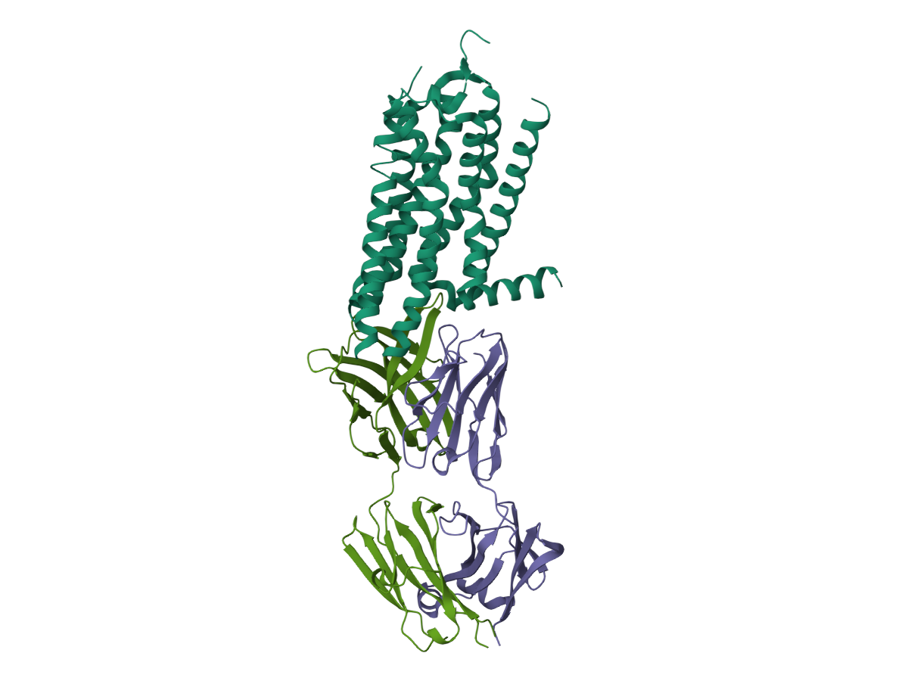
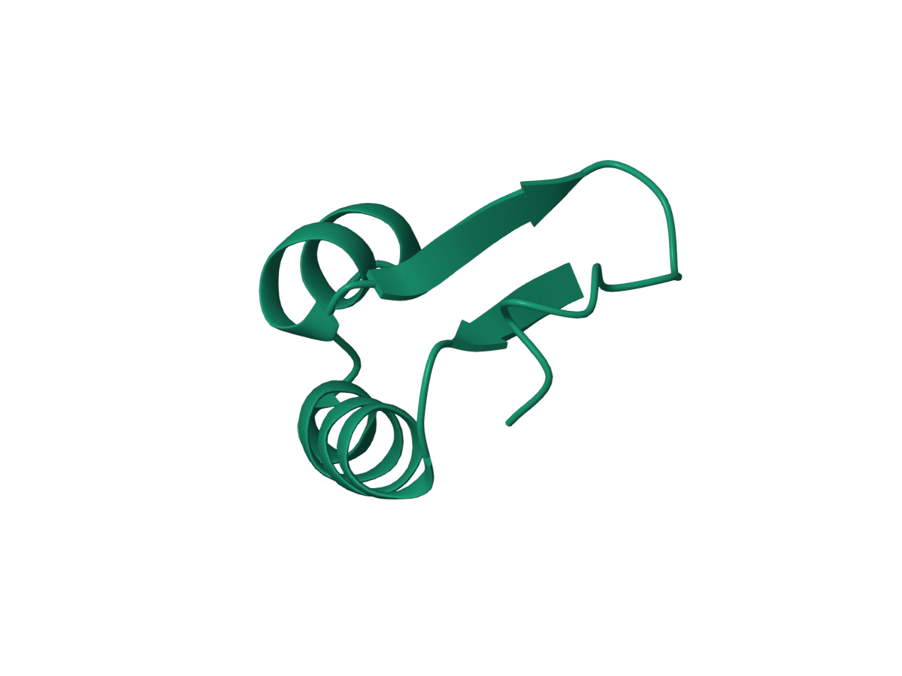
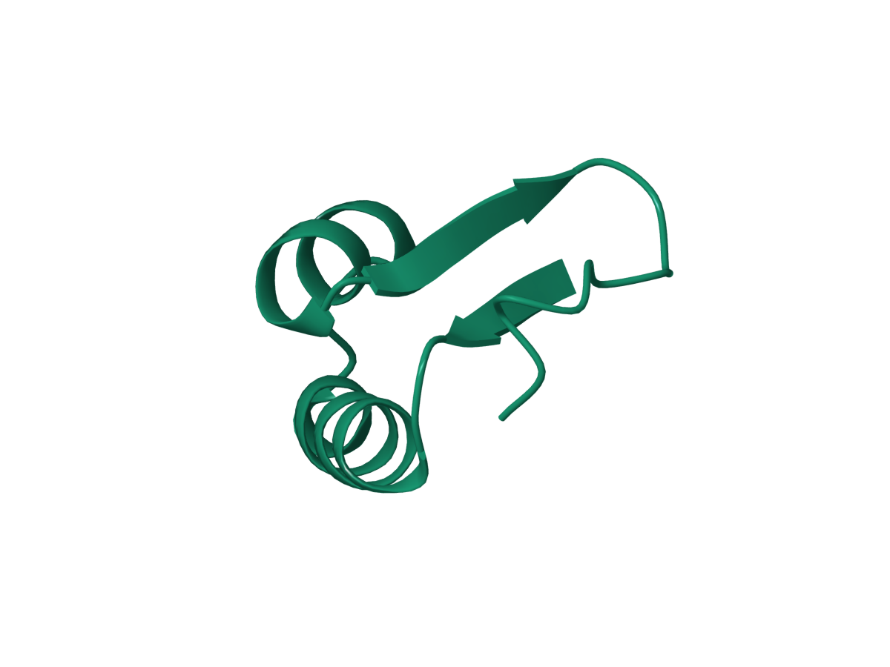
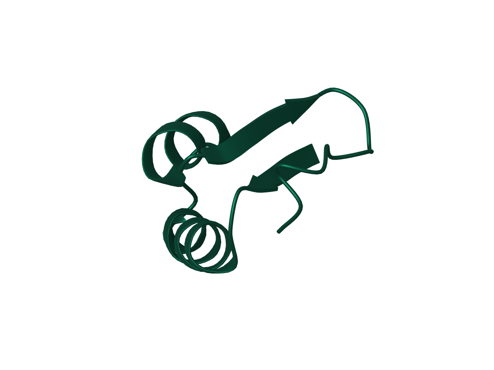
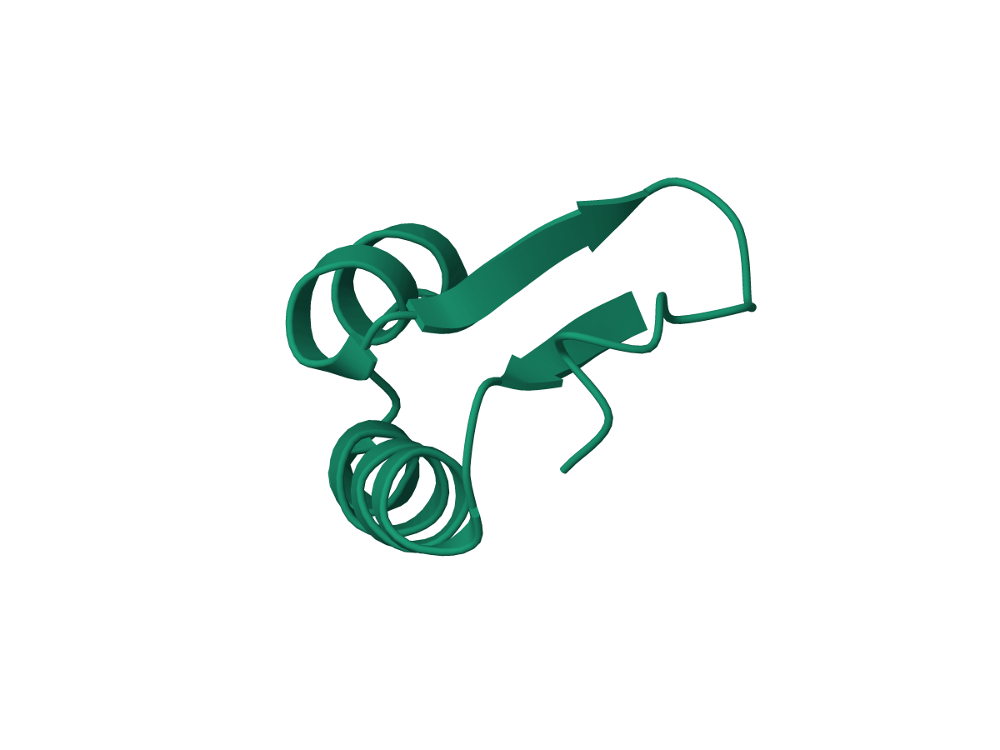
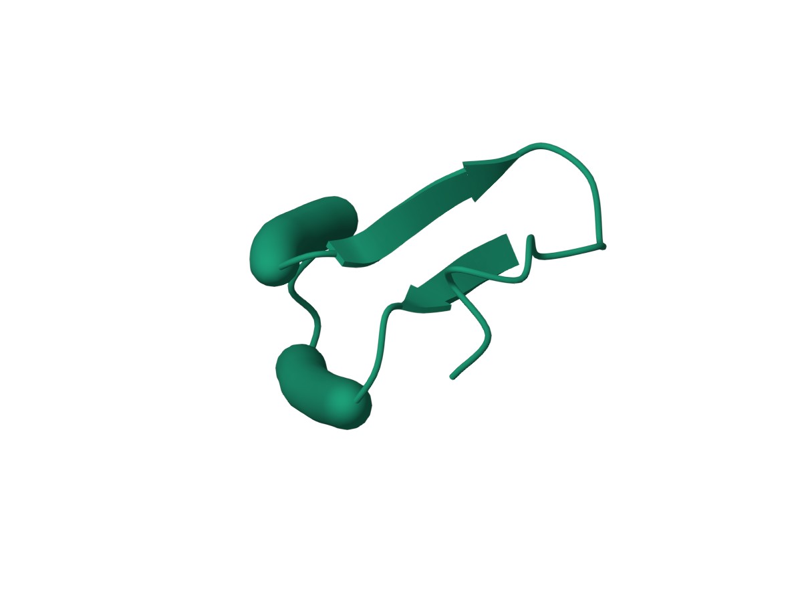
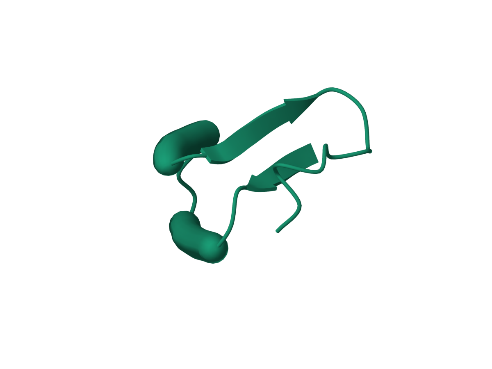

# Comparison with actual Mol* rendering

[Package README](../README.md) | [日本語](ja/fidelity.md) | [Guide](pymol_molstar.md) | [Documentation](README.md)

The renderer now follows Mol*'s residue-local ribbon construction, GGX material,
camera-relative lighting, chain palette order and 32-sample ambient occlusion.
This comparison executes the original TypeScript at revision
`5b1b54ed03b03936041f514b33b8bb129b774d37`; the reference image is a browser render
of Mol* itself. The PyMOL images come from separate real Qt/OpenGL and native ray
processes. No CI rendering or generated illustration is used.

## 8GNG

The receptor and antibody chains A, H and L are selected from the same RCSB mmCIF.
The original full model remains available for chain-color ordering. These are
cartoon traces only; ligand sticks and the RCSB application interface are excluded
from this controlled comparison. The camera comes from Mol*, rather than being
estimated from a screenshot.

| Mol* reference | PyMOL GPU | PyMOL dedicated ray |
| --- | --- | --- |
|  |  |  |

At 1200 × 900, the GPU silhouette intersection-over-union is **98.15%** and
interior RGB mean absolute error is **1.32/255**. Dedicated ray gives **96.70%**
and **2.30/255**. These are measured errors for this registered scene, not a
universal percentage of Mol* compatibility.

## Other shapes and materials

All cases use the same input coordinates, secondary structure, representation
parameters and camera in both programs. They use orthographic projection, a white
background, no fog, 8 linear and 16 radial subdivisions, default light and ambient
intensities 0.6 and 0.4, and 32-sample SSAO (radius 2^5 Å, bias 0.8, blur kernel 15).
Mol* uses SMAA; PyMOL uses its own antialiasing. Each row has its own Mol* camera.

| Case | GPU silhouette IoU | GPU RGB MAE /255 | Ray silhouette IoU | Ray RGB MAE /255 |
| --- | ---: | ---: | ---: | ---: |
| 8GNG, chain colors | 98.15% | 1.32 | 96.70% | 2.30 |
| 1CRN, matte | 99.25% | 0.67 | 98.36% | 2.14 |
| 1CRN, plastic | 99.25% | 0.95 | 98.34% | 2.57 |
| 1CRN, glossy | 99.13% | 0.75 | 98.12% | 2.18 |
| 1CRN, metallic | 99.25% | 2.17 | 98.30% | 3.08 |
| 1CRN, rounded helix profile | 99.40% | 0.67 | 98.55% | 2.04 |
| 1CRN, tubular helices with round caps | 99.50% | 0.50 | 98.89% | 2.19 |
| 1BNA, DNA backbone | 99.20% | 0.57 | 98.09% | 1.97 |

Foreground means at least one RGB channel below 235. IoU compares the two masks;
RGB error uses their intersection eroded by two pixels. No image alignment, color
fitting or intensity normalization is performed. These metrics exclude white
background and soften the contribution of edge antialiasing; inspect the PNGs too.

| Case | Mol* reference | PyMOL GPU | PyMOL ray |
| --- | --- | --- | --- |
| Matte |  |  |  |
| Plastic |  |  |  |
| Glossy |  |  |  |
| Metallic |  |  |  |
| Rounded |  |  |  |
| Tubular, round caps |  |  |  |
| DNA backbone |  |  |  |

## Numerical checks and limits

The reference viewer also exports Mol*'s control points, per-residue curves, normal
frames and mesh vertices. For 8GNG A/H/L (721 residues), curve coordinates differ
by at most **0.000031 Å** and matched surface vertices by **0.000039 Å**.
1CRN (46 residues), including rounded/tubular variants, and 1BNA (24 residues) pass
the same 0.0001 tolerance. Native PyMOL H/S/coil assignments match these structures;
the image harness can also apply the exported assignments explicitly.

Surface-vertex comparison excludes centerline vertices used solely to triangulate
caps. PyMOL merges Mol*'s turn categories into coil, so extra internal cap disks
can differ despite identical outer rings. These checks cover ordinary continuous
atomic polymers, not every cyclic/coarse/missing-residue case or nucleotide base
visual. Those and the other visualization families retain the limits in the
[coverage table](coverage.md).

Dedicated ray evaluates the physical material at vertices; GPU evaluates fragments,
including derivative roughness and optional bump. Standard PyMOL ray retains native
lighting. Dedicated ray also retains native lighting when unmanaged visible objects
share the scene. Transparency uses sorted triangles rather than Mol*'s OIT backend.
Other effects, including progressive illumination, are not equivalent to Mol*.

Dedicated density ray output now integrates the scalar field at each image pixel,
clipping against managed opaque meshes, instead of displaying coarse transparent
triangles. Its sampling follows the local GPU volume renderer; this is a separate
GPU/ray consistency check, not a Mol* volume comparison. Mixed unmanaged or
transparent mesh scenes retain the native sampled-plane fallback.
The gallery's Gaussian-volume pair has 99.97% silhouette IoU and RGB MAE 0.13/255.

The complete local gallery covers 82 examples in GPU/ray; the subvisual check covers
55 branches. All 273 numerical/lifecycle tests, Ruff, and package builds pass locally.
See [reproduction instructions](../tests/reference/README.md) and the checked-in
[case definitions](../tests/reference/cases.json). Downloaded structures, browser
bundles, raw JSON exports and machine-specific reports remain under ignored `.cache/`.

## Source

- [Polymer trace mesh](https://github.com/molstar/molstar/blob/5b1b54ed03b03936041f514b33b8bb129b774d37/src/mol-repr/structure/visual/polymer-trace-mesh.ts), [curve segment](https://github.com/molstar/molstar/blob/5b1b54ed03b03936041f514b33b8bb129b774d37/src/mol-repr/structure/visual/util/polymer/curve-segment.ts).
- [Physical light functions](https://github.com/molstar/molstar/blob/5b1b54ed03b03936041f514b33b8bb129b774d37/src/mol-gl/shader/chunks/light-frag-params.glsl.ts), [SSAO](https://github.com/molstar/molstar/blob/5b1b54ed03b03936041f514b33b8bb129b774d37/src/mol-canvas3d/passes/ssao.ts).
- RCSB inputs: [8GNG](https://www.rcsb.org/structure/8GNG), [1CRN](https://www.rcsb.org/structure/1CRN), [1BNA](https://www.rcsb.org/structure/1BNA).
